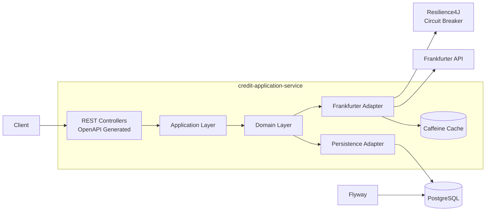

# 🚀 credit-application-service

## Set Up Inicial del proyecto

Este proyecto está completamente dockerizado y puede ejecutarse utilizando `docker-compose`.

### 1. Configurar variables de entorno
Antes de levantar los servicios, es necesario crear un archivo **.env** en la raíz del proyecto con el siguiente template:

```env
SPRING_DATASOURCE_URL=data
SPRING_DATASOURCE_USERNAME=data
SPRING_DATASOURCE_PASSWORD=data
EXTERNAL_FRANKFURTER_URL=data
```
> ⚠️ **Nota:** Estas variables son requeridas por la aplicación para conectarse a la base de datos y al proveedor externo de tipo de cambio. 

---

### 2. Levantar el proyecto con Docker Compose

#### 🔹 Primera vez o después de cambios en el código

Si es la primera ejecución o se realizaron cambios en el código fuente:

```bash
docker compose up --build
```

#### 🔹 Modo detached (sin logs en consola)

Para ejecutar en segundo plano:

```bash
docker compose up --build -d
```

---

#### 🔹 Ejecuciones posteriores

Si las imágenes ya están construidas localmente:

```bash
docker compose up
```

o en segundo plano:

```bash
docker compose up -d
```


---

### 3. Persistencia de base de datos

El `docker-compose` está configurado con **volúmenes para PostgreSQL**, por lo que:

* La información de la base de datos no se pierde al detener o eliminar los contenedores.
* Los datos persisten incluso al ejecutar `docker compose down`.

---

## 🧪 Cómo probar el proyecto

El proyecto incluye una collección de Postman ubicada en la carpeta:

````csv
collections/
````
La colección contiene:
* Todos los endpoints disponibles del servicio.
* Ejemplos de requests para distintos escenarios.
---
#### Configuración de variables de entorno en Postman
La colección requiere definir la siguiente variable de entorno:
```
CREDIT_APPLICATION_URL=localhost:8080/api/v1
```
> ⚠️ **Nota:** Por defecto, el proyecto expone la API en el puerto 8080.

---

## 🏗️ Decisiones técnicas
#### Arquitectura Hexagonal
Se implementó una arquitectura hexagonal (Ports & Adapters) con el objetivo de desacoplar la lógica de negocio de detalles de infraestructura como base de datos,
controladores HTTP o servicios externos.

Esto permite:
* Mejor mantenibilidad.
* Mayor facilidad para pruebas unitarias.
* Sustitución sencilla de tecnologías externas.
* Evolución gradual hacia una arquitectura basada en microservicios.

---
#### OpenAPI Code Generation y enfoque API First
Se utilizó OpenAPI Generator para generar automáticamente interfaces y contratos de los controllers
a partir de la especificación OpenAPI.

El proyecto sigue un enfoque **API First (Design FIRST)**, donde el contrato de la API se define antes de la implementación.

Beneficios de este enfoque:
* Contratos API centralizados y consistentes.
* Documentación Swagger generada automáticamente.
* Reducción de código boilerplate.
* Menor probabilidad de inconsistencias entre documentación e implementación.
* Facilita la colaboración entre frontend, backend, QA y otras áreas.
* Permite trabajar sobre contratos estables incluso antes de finalizar la implementación.

Se Optó por este enfoque debido a que resulta más escalable y mantenible en equipos grandes y organizados,
en comparación con estrategias **Code First**, donde la documentación depende directamente de la implementación.

---
#### Uso de MapStruct y Lombok
Se incorporó:
* **MapStruct** para el mapeo entre entidades, DTOs y modelos de dominio.
* **Lombook** para reducir código repetitivo (getters, builders, constructors, etc.).

El objetivo fue mantener el código más limpio, legible y mantenible.

---
#### QueryDSL para consultas dinámicas
Se utilizó **QueryDSL** para implementar consultas complejas y filtros dinámicos.

Esto permite:
* Queries type-safe.
* Mejor mantenibilidad frente a SQL nativo complejo.
* Construcción dinámica de filtros sin concatenación manual de strings.
* Mayor facilidad para escalar funcionalidades de búsqueda.

---
#### Resilience4J y tolerancia a fallos
La integración con el proveedor externo de tipo de cambio fue protegida utilizando
**Resilience4J** mediante Circuit Breaker.

Objetivos:
* Evitar fallos en cascada.
* Mejorar resiliencia ante indisponibilidad del proveedor externo.
* Permitir una degradación controlada del servicio.

---
#### Estrategia de caché
Se agregó caché para las consultas al servicio externo **Frankfurter** con el objetivo de:
* Reducir llamadas innecesarias al proveedor externo.
* Mejorar tiempos de respuesta.
* Disminuir dependencia de la disponibilidad externa.

---
#### Flyway para migraciones
Se utilizó Flyway para versionar y ejecutar automáticamente migraciones de base de datos
al iniciar la aplicación.

Beneficios:
* Consitencia de esquema entre ambientes.
* Evita drift de base de datos entre desarrolladores.
* Trazabilidad de cambios.
* Mayor seguridad al evolucionar entidades Hibernate.

---
### 🚧 Qué se dejó fuera y por qué
Para mantener el alcance enfocado y priorizar la entrega de funcionalidades principales,
algunas características fueron dejadas fuera intencionalmente:
* Pipeline CI/CD.
* Despliegue en Kubernetes
* Sistema distribuido de trazabilidad.
* Arquitectura event-driven completa.
* Observabilidad avanzada.

---
### 🔮 Mejoras futuras planeadas
El proyecto fue diseñado considerando futuras extensiones, entre ellas:

#### Arquitectura Event-Driven
Se planea incorporar RabbitMQ para comunicación asíncrona entre microservicios
y manejo de eventos de dominio.

Esto permitirá integrar futuros servicios como:
* client-service
* notificaciones
* auditoría
* procesamiento asíncrono de transacciones

---
#### Observabilidad y monitoreo
Se contempla integrar herramientas como:
* Grafana
* Prometheus
* Loki
* AlertManager

Con el objetivo de:
* centralizar logs,
* monitorear métricas,
* generar alertas,
* y mejorar trazabilidad operativa del sistema.

---
#### Idempotencia en creación de solicitudes
Se planea incorporar mecanismos de idempotencia en el proceso de creación de 
``CreditApplication``.

El objetivo es proteger la operación ante escenarios como:
* reintentos automáticos (``retry``)
* duplicación accidental de requests.
* errores de res,
* y problemas de concurrencia.

Esto permitirá garantizar que una misma operación no genere múltiples registros
inconsistentes ante llamadas repetidas del cliente o fallos temporales de comunicación.

---

## ⚙️ Cómo correr las pruebas
El proyecto cuenta con:
* pruebas unitarias,
* pruebas de integración,
* pruebas de controllers,
* pruebas utilizando Testcontainers y WireMock.

Para ejecutar toda la suite de pruebas:
````csv
./mvnw test
````
o en Windows:
````csv
./mvnw.cmd test
````
> ⚠️ **Nota:** Si no cuentas con maven en tu máquina utiliza los mvnw que vienen en el proyecto

#### Tecnologías utilizadas en pruebas
* JUnit 5
* Mockito
* Spring Boot Test
* Testcontainers (PostgreSQL)
* WireMock (mock del proveedor externo Frankfurter)

---
## 🗄️Migraciones de base de datos
El proyecto utiliza Flyway para el versionado y ejecución de migraciones SQL.

Las migraciones se ejecutan automáticamente al iniciar la aplicación, por lo que no es necesario correr comandos manuales adicionales.

Ubicación de migraciones:
````csv
src/main/resources/db/migration
````
Cada migración sigue el esquema estándar de versionado de Flyway:
````csv
V1__initial_schema.sql
V2__new_tables.sql
````
Esto garantiza:
* consistencia del esquema entre ambientes,
* trazabilidad de cambios,
* y facilidad para evolucionar la base de datos de forma controlada.

---
## ⭐ Bonus implementados
Además de los requerimientos principales, se implementaron los siguientes puntos adicionales:

#### Cache de tipos de cambio
Se implementó caché utilizando Caffeine con un TTL de 1 hora para reducir llamadas
innecesarias al proveedor externo Frankfurter y mejorar tiempos de respuesta.

#### Resiliencia con Resilience4J
Las llamadas al servicio externo Frankfurter fueron protegidas utilizando Resilience4J
mediante Circuit Breaker.

Esto permite evitar fallos en cascada y mantener operativo el proceso de creación de 
``CreditApplication`` ante problemas temporales del proveedor externo.

#### Cobertura de código con JaCoCo
Se integró JaCoCo para generación de métricas de cobertura de pruebas.

#### Pruebas de integración
Se implementaron pruebas de integración utilizando:
* Testcontainers para PostgreSQL real,
* WireMock para mockear el proveedor externo Frankfurter

Esto permite validar escenarios reales de infraestructura y comunicación externa de forma aislada y reproducible.

#### OpenAPI / Swagger UI
Se agregó documentación interactiva utilizando OpenAPI y Swagger UI.

Además se utilizó generación automática de código basada en contratos OpenAPI bajo un enfoque API First.

## 🏛️ Arquitectura

